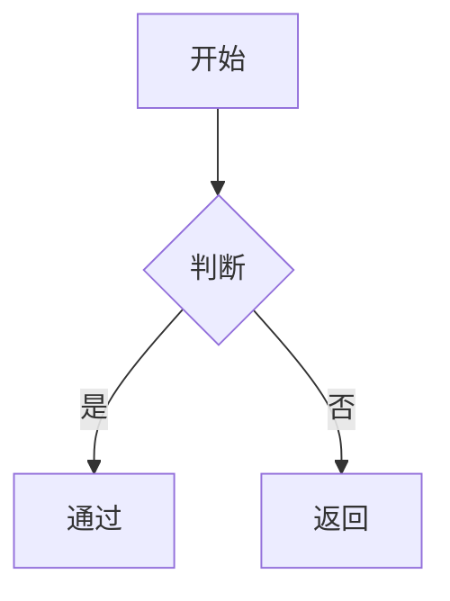

# Preview Theme Visual Fixes Implementation Plan

> **For agentic workers:** REQUIRED SUB-SKILL: Use superpowers:subagent-driven-development to implement this plan task-by-task on the current branch. Steps use checkbox (`- [ ]`) syntax for tracking.

**Goal:** 在不改预览主题对外名称、配置值和当前分支的前提下，一次性修复预览主题的复制按钮、`kbd`、`details`、受影响主题暗黑表面以及回归测试缺口。

**Architecture:** 本次实现分为“测试与样本先行、基础协议与骨架补齐、Markdown 输出结构收口、受影响主题变量化修复、最终验证”五个部分。基础层只补统一语义与变量协议，主题层只修本轮问题涉及的 6 个主题；执行必须留在当前分支 `feat/preview-theme-variable-refactor`，并使用 `@superpowers:subagent-driven-development`，不创建 worktree。

**Tech Stack:** Vue 3、SCSS、markdown-it、Mermaid 11、Node `node:test`、ESLint、Vite 6

---

## File Map

### Create

- `wj-markdown-editor-web/src/util/markdown-it/__tests__/markdownItCodeBlock.test.js`
  - 约束代码块复制按钮输出结构，防止再次回到 `hidden + 内联工具类` 的旧路径。
- `wj-markdown-editor-web/src/util/markdown-it/__tests__/markdownItContainerUtil.test.js`
  - 约束 `details` 渲染结构，确保不再复用提示容器样式和内联 `summary` 样式。

### Modify

- `wj-markdown-editor-web/src/util/markdown-it/markdownItCodeBlock.js`
  - 收口复制按钮结构、文案单一来源和可访问属性。
- `wj-markdown-editor-web/src/util/markdown-it/markdownItContainerUtil.js`
  - 将 `details` 渲染改为独立 disclosure 结构。
- `wj-markdown-editor-web/src/assets/style/wj-markdown-it-container.scss`
  - 移除 `details` 在提示容器样式体系中的职责。
- `wj-markdown-editor-web/src/assets/style/preview-theme/preview-theme-contract.scss`
  - 补齐 `kbd`、代码块工具栏、代码块外壳、Mermaid、主题根背景、`details` 的统一变量协议。
- `wj-markdown-editor-web/src/assets/style/preview-theme/preview-theme-base.scss`
  - 消费新增变量，承接 `kbd`、代码块工具栏、Mermaid 外壳、根背景、`details` 的基础表面。
- `wj-markdown-editor-web/src/assets/style/preview-theme/theme/juejin.scss`
  - 修复标题层级、斑马纹、`kbd` 和 dark 表面变量。
- `wj-markdown-editor-web/src/assets/style/preview-theme/theme/smart-blue.scss`
  - 修复 dark 引用/表格/Mermaid/背景纹理，以及 `kbd` 变量覆盖。
- `wj-markdown-editor-web/src/assets/style/preview-theme/theme/vuepress.scss`
  - 修复 `kbd` 与 dark 引用变量。
- `wj-markdown-editor-web/src/assets/style/preview-theme/theme/mk-cute.scss`
  - 修复 `kbd`、dark 表格/Mermaid、背景纹理变量。
- `wj-markdown-editor-web/src/assets/style/preview-theme/theme/scrolls.scss`
  - 修复 `kbd` 与 dark 表格/Mermaid 变量。
- `wj-markdown-editor-web/src/assets/style/preview-theme/theme/markdown-here.scss`
  - 修复无序列表、`kbd`、dark 引用/表格/Mermaid 变量。
- `wj-markdown-editor-web/src/assets/style/__tests__/fixtures/preview-theme-regression.md`
  - 补充 `kbd`、Mermaid、多级列表、`details` 回归样本。
- `wj-markdown-editor-web/src/assets/style/__tests__/previewThemeStructure.test.js`
  - 约束回归样本和基础骨架对新语义的覆盖。
- `wj-markdown-editor-web/src/assets/style/__tests__/previewThemeVariableCoverage.test.js`
  - 约束受影响主题的 `kbd` 迁移、`juejin` 标题层级和 dark 最小变量覆盖矩阵。

### Reuse

- `wj-markdown-editor-web/src/assets/style/__tests__/previewThemePriorityArchitecture.test.js`
  - 第一阶段根选择器架构测试无需改逻辑，继续提供根作用域保护。
- `wj-markdown-editor-web/src/util/__tests__/previewMermaidRenderUtil.test.js`
  - 复用现有 Mermaid 渲染收敛测试，确保未引入运行时链路回归。

## Execution Notes

- 用户明确要求：实现必须在当前分支 `feat/preview-theme-variable-refactor` 上完成，不创建新分支、不使用 worktree。
- 用户明确要求：执行阶段必须使用 `@superpowers:subagent-driven-development`，不要切换为 inline execution。
- 所有命令默认在 `wj-markdown-editor-web/` 目录执行，除非步骤里单独标注仓库根目录。
- 每个任务完成后都要做一次小范围验证和一次小提交，避免把样式协议、渲染结构和主题修复混成一个大 patch。
- 最终声明完成前必须执行 `@superpowers:verification-before-completion`。

## Task 1: 先锁定回归样本与样式断言

**Files:**
- Modify: `wj-markdown-editor-web/src/assets/style/__tests__/fixtures/preview-theme-regression.md`
- Modify: `wj-markdown-editor-web/src/assets/style/__tests__/previewThemeStructure.test.js`
- Modify: `wj-markdown-editor-web/src/assets/style/__tests__/previewThemeVariableCoverage.test.js`

- [ ] **Step 1: 先为回归样本补齐本轮缺失的 Markdown 场景**

将 `preview-theme-regression.md` 补齐以下内容：

```md
这是 `kbd` 示例：按下 <kbd>Ctrl</kbd> + <kbd>K</kbd> 打开命令面板。

- 一级无序项
  - 二级无序项
    - 三级无序项



::: details 点击展开详情
这里是 details 容器的内容。
:::
```

- [ ] **Step 2: 为结构测试补失败断言，锁定新样本与基础语义**

在 `previewThemeStructure.test.js` 中新增或扩展断言，至少覆盖：

```js
test('预览主题回归样本必须覆盖 kbd、mermaid 和多级无序列表', () => {
  const source = readSource('./fixtures/preview-theme-regression.md')

  assert.match(source, /<kbd>Ctrl<\/kbd>/u)
  assert.match(source, /```mermaid/u)
  assert.match(source, /- 一级无序项[\s\S]*- 二级无序项[\s\S]*- 三级无序项/u)
})

test('基础层必须消费 kbd、mermaid、details 与主题根背景变量', () => {
  const baseSource = readSource('../preview-theme/preview-theme-base.scss')

  assert.match(baseSource, /:where\(kbd\)/u)
  assert.match(baseSource, /pre\.mermaid,\s*pre\.mermaid-cache/u)
  assert.match(baseSource, /background-image:\s*var\(--wj-preview-theme-background-image\)/u)
  assert.match(baseSource, /:where\(details\)/u)
})
```

- [ ] **Step 3: 为主题变量覆盖测试补失败断言，锁定矩阵与标题层级**

在 `previewThemeVariableCoverage.test.js` 中新增或扩展断言，至少覆盖：

```js
test('juejin 主题标题层级必须满足 h3 > h4 > h5 > h6', () => {
  const source = readSource('../preview-theme/theme/juejin.scss')

  assert.match(source, /--wj-preview-h3-font-size:\s*18px;/u)
  assert.match(source, /--wj-preview-h4-font-size:\s*17px;/u)
  assert.match(source, /--wj-preview-h5-font-size:\s*16px;/u)
  assert.match(source, /--wj-preview-h6-font-size:\s*15px;/u)
})

test('juejin 明亮模式必须保留表格斑马纹变量', () => {
  const source = readSource('../preview-theme/theme/juejin.scss')

  assert.match(source, /--wj-preview-table-row-even-background-color:\s*#fcfcfc;/u)
})

test('受影响主题不得继续用 kbd 选择器承担主外观', () => {
  for (const name of ['juejin', 'smart-blue', 'vuepress', 'mk-cute', 'scrolls', 'markdown-here']) {
    const source = readSource(`../preview-theme/theme/${name}.scss`)
    assert.equal(/(^|\\n)\\s*kbd\\s*\\{/u.test(source), false)
  }
})
```

- [ ] **Step 4: 运行测试，确认这些新增断言先红灯**

Run:

```bash
npm run test:run -- src/assets/style/__tests__/previewThemeStructure.test.js src/assets/style/__tests__/previewThemeVariableCoverage.test.js
```

Expected:

```text
FAIL，原因包括回归样本尚未补齐、基础层尚未消费新变量、受影响主题仍保留 kbd 选择器或 juejin 标题层级未修复
```

- [ ] **Step 5: 提交测试与样本脚手架**

```bash
git add src/assets/style/__tests__/fixtures/preview-theme-regression.md src/assets/style/__tests__/previewThemeStructure.test.js src/assets/style/__tests__/previewThemeVariableCoverage.test.js
git commit -m "test(web): lock preview theme visual regression cases"
```

## Task 2: 锁定 Markdown 输出结构

**Files:**
- Create: `wj-markdown-editor-web/src/util/markdown-it/__tests__/markdownItCodeBlock.test.js`
- Create: `wj-markdown-editor-web/src/util/markdown-it/__tests__/markdownItContainerUtil.test.js`
- Modify: `wj-markdown-editor-web/src/util/markdown-it/markdownItCodeBlock.js`
- Modify: `wj-markdown-editor-web/src/util/markdown-it/markdownItContainerUtil.js`

- [ ] **Step 1: 为代码块输出新增失败测试**

创建 `markdownItCodeBlock.test.js`，至少覆盖：

```js
import assert from 'node:assert/strict'
import MarkdownIt from 'markdown-it'
import { test } from 'node:test'
import codeBlockPlugin from '../markdownItCodeBlock.js'

test('代码块复制按钮必须保留语义类且不再依赖 hidden', () => {
  const md = new MarkdownIt()
  codeBlockPlugin(md)

  const html = md.render('```js\\nconsole.log(1)\\n```')

  assert.match(html, /class="[^"]*pre-container-copy[^"]*"/u)
  assert.equal(html.includes('hidden'), false)
  assert.match(html, /title="复制"/u)
  assert.match(html, /aria-label="复制"/u)
})
```

- [ ] **Step 2: 为 details 输出新增失败测试**

创建 `markdownItContainerUtil.test.js`，至少覆盖：

```js
import assert from 'node:assert/strict'
import MarkdownIt from 'markdown-it'
import markdownItContainer from 'markdown-it-container'
import { test } from 'node:test'
import markdownItContainerUtil from '../markdownItContainerUtil.js'

test('details 不得继续输出 wj-markdown-it-container 外层和 summary 内联样式', () => {
  const md = new MarkdownIt()
  const plugins = markdownItContainerUtil.createContainerPlugin(md, ['details'])
  plugins.forEach(plugin => md.use(markdownItContainer, plugin.type, plugin))

  const html = md.render('::: details 标题\\n正文\\n:::')

  assert.equal(html.includes('wj-markdown-it-container-details'), false)
  assert.equal(html.includes('style='), false)
  assert.match(html, /<details/u)
  assert.match(html, /<summary>/u)
})
```

- [ ] **Step 3: 运行测试，确认红灯**

Run:

```bash
npm run test:run -- src/util/markdown-it/__tests__/markdownItCodeBlock.test.js src/util/markdown-it/__tests__/markdownItContainerUtil.test.js
```

Expected:

```text
FAIL，原因包括复制按钮仍带 hidden、缺少 aria-label，details 仍输出提示容器根类或 summary 内联样式
```

- [ ] **Step 4: 实现最小结构调整**

实现方向：

```js
const COPY_CODE_LABEL = '复制'

return html`
  <div class="relative pre-container">
    <div class="absolute top-0 right-0 p-1 z-10">
      <div class="pre-container-lang">${lang}</div>
      <div
        class="pre-container-copy i-tabler:copy"
        title="${COPY_CODE_LABEL}"
        aria-label="${COPY_CODE_LABEL}"
        onclick="copyCode('${commonUtil.strToBase64(code)}')"></div>
    </div>
    ...
  </div>
`
```

```js
if (type.toLowerCase() === 'details') {
  if (tokens[idx].nesting === 1) {
    return `<details class="wj-preview-details"><summary>${title}</summary>\n<div class="wj-preview-details-content">\n`
  }
  return '</div></details>\n'
}
```

- [ ] **Step 5: 重新运行这两组测试，确认转绿**

Run:

```bash
npm run test:run -- src/util/markdown-it/__tests__/markdownItCodeBlock.test.js src/util/markdown-it/__tests__/markdownItContainerUtil.test.js
```

Expected:

```text
PASS
```

- [ ] **Step 6: 按文件执行 ESLint 修复并提交**

```bash
npx eslint --fix src/util/markdown-it/markdownItCodeBlock.js src/util/markdown-it/markdownItContainerUtil.js src/util/markdown-it/__tests__/markdownItCodeBlock.test.js src/util/markdown-it/__tests__/markdownItContainerUtil.test.js
git add src/util/markdown-it/markdownItCodeBlock.js src/util/markdown-it/markdownItContainerUtil.js src/util/markdown-it/__tests__/markdownItCodeBlock.test.js src/util/markdown-it/__tests__/markdownItContainerUtil.test.js
git commit -m "refactor(web): normalize preview markdown output"
```

## Task 3: 补齐基础协议、基础骨架和 details 容器职责

**Files:**
- Modify: `wj-markdown-editor-web/src/assets/style/preview-theme/preview-theme-contract.scss`
- Modify: `wj-markdown-editor-web/src/assets/style/preview-theme/preview-theme-base.scss`
- Modify: `wj-markdown-editor-web/src/assets/style/wj-markdown-it-container.scss`
- Modify: `wj-markdown-editor-web/src/assets/style/__tests__/previewThemeStructure.test.js`
- Modify: `wj-markdown-editor-web/src/assets/style/__tests__/previewThemeVariableCoverage.test.js`

- [ ] **Step 1: 先为 contract/base 的新变量消费补失败断言**

至少增加以下断言：

```js
test('基础层消费到的新变量必须在 contract 中声明', () => {
  const baseSource = readSource('../preview-theme/preview-theme-base.scss')
  const contractSource = readSource('../preview-theme/preview-theme-contract.scss')

  for (const variableName of [
    '--wj-preview-kbd-text-color',
    '--wj-preview-code-toolbar-text-color',
    '--wj-preview-code-toolbar-background-color',
    '--wj-preview-code-toolbar-hover-opacity',
    '--wj-preview-mermaid-background-color',
    '--wj-preview-mermaid-text-align',
    '--wj-preview-theme-background-image',
    '--wj-preview-theme-background-size',
    '--wj-preview-theme-background-position',
    '--wj-preview-details-padding',
    '--wj-preview-details-background-color',
    '--wj-preview-details-border',
    '--wj-preview-details-border-radius',
    '--wj-preview-details-open-summary-margin-bottom',
    '--wj-preview-summary-text-color',
    '--wj-preview-summary-font-weight',
    '--wj-preview-code-toolbar-opacity',
  ]) {
    assert.match(contractSource, new RegExp(`${variableName}\\s*:`))
    assert.match(baseSource, new RegExp(`var\\(${variableName.replace(/[-/\\^$*+?.()|[\]{}]/g, '\\\\$&')}\\)`))
  }
})
```

- [ ] **Step 2: 实现 contract 与 base 的最小补齐**

实现方向：

```scss
.wj-preview-theme {
  --wj-preview-kbd-padding: 0.125em 0.45em;
  --wj-preview-kbd-text-color: var(--wj-markdown-text-primary);
  --wj-preview-kbd-background-color: var(--wj-markdown-bg-secondary);
  --wj-preview-kbd-border: 1px solid var(--wj-markdown-border-primary);
  --wj-preview-code-toolbar-text-color: var(--wj-markdown-text-secondary);
  --wj-preview-code-toolbar-background-color: var(--wj-markdown-bg-secondary);
  --wj-preview-code-toolbar-opacity: 0.65;
  --wj-preview-code-toolbar-hover-opacity: 1;
  --wj-preview-mermaid-background-color: var(--wj-preview-code-block-background-color);
  --wj-preview-mermaid-text-align: center;
  --wj-preview-theme-background-image: none;
  --wj-preview-theme-background-size: auto;
  --wj-preview-theme-background-position: 0 0;
  --wj-preview-details-padding: 0.75em 1em;
  --wj-preview-details-background-color: var(--wj-preview-background-color-transparent);
  --wj-preview-details-border: 1px solid var(--wj-markdown-border-primary);
  --wj-preview-details-border-radius: 8px;
  --wj-preview-details-open-summary-margin-bottom: 0.75em;
  --wj-preview-summary-text-color: var(--wj-markdown-text-primary);
  --wj-preview-summary-font-weight: 500;
}
```

```scss
.wj-preview-theme :where(kbd) {
  padding: var(--wj-preview-kbd-padding);
  color: var(--wj-preview-kbd-text-color);
  background-color: var(--wj-preview-kbd-background-color);
  border: var(--wj-preview-kbd-border);
}

.wj-preview-theme :where(pre.mermaid, pre.mermaid-cache) {
  padding: var(--wj-preview-mermaid-padding);
  background-color: var(--wj-preview-mermaid-background-color);
  border-radius: var(--wj-preview-mermaid-border-radius);
  text-align: var(--wj-preview-mermaid-text-align);
}
```

- [ ] **Step 3: 清理 `wj-markdown-it-container.scss` 对 details 的职责**

实现方向：

```scss
.wj-markdown-it-container.wj-markdown-it-container-details {
  /* 删除整个 details 专属分支，不再保留 */
}
```

保留 `info` / `warning` / `danger` / `tip` / `important` 的提示容器职责，不顺手重写其他容器。

- [ ] **Step 4: 运行样式测试，确认协议与基础层转绿**

Run:

```bash
npm run test:run -- src/assets/style/__tests__/previewThemeStructure.test.js src/assets/style/__tests__/previewThemeVariableCoverage.test.js
```

Expected:

```text
PASS 或仅剩受影响主题变量覆盖相关失败
```

- [ ] **Step 5: 执行 ESLint 修复并提交**

```bash
npx eslint --fix src/assets/style/preview-theme/preview-theme-contract.scss src/assets/style/preview-theme/preview-theme-base.scss src/assets/style/wj-markdown-it-container.scss src/assets/style/__tests__/previewThemeStructure.test.js src/assets/style/__tests__/previewThemeVariableCoverage.test.js
git add src/assets/style/preview-theme/preview-theme-contract.scss src/assets/style/preview-theme/preview-theme-base.scss src/assets/style/wj-markdown-it-container.scss src/assets/style/__tests__/previewThemeStructure.test.js src/assets/style/__tests__/previewThemeVariableCoverage.test.js
git commit -m "refactor(web): add preview theme surface contract"
```

## Task 4: 修复受影响主题并落地 dark 覆盖矩阵

**Files:**
- Modify: `wj-markdown-editor-web/src/assets/style/preview-theme/theme/juejin.scss`
- Modify: `wj-markdown-editor-web/src/assets/style/preview-theme/theme/smart-blue.scss`
- Modify: `wj-markdown-editor-web/src/assets/style/preview-theme/theme/vuepress.scss`
- Modify: `wj-markdown-editor-web/src/assets/style/preview-theme/theme/mk-cute.scss`
- Modify: `wj-markdown-editor-web/src/assets/style/preview-theme/theme/scrolls.scss`
- Modify: `wj-markdown-editor-web/src/assets/style/preview-theme/theme/markdown-here.scss`
- Modify: `wj-markdown-editor-web/src/assets/style/__tests__/previewThemeVariableCoverage.test.js`

- [ ] **Step 1: 先写失败断言，锁定 6 个主题的最小覆盖矩阵**

以矩阵为准，至少新增：

```js
test('smart-blue dark 分支必须覆盖引用、表格、mermaid 和背景纹理变量', () => {
  const source = readSource('../preview-theme/theme/smart-blue.scss')

  assertDarkThemeBranchHasRequiredVariables(source, '.preview-theme-smart-blue', [
    '--wj-preview-blockquote-background-color',
    '--wj-preview-table-row-even-background-color',
    '--wj-preview-mermaid-background-color',
    '--wj-preview-theme-background-image',
  ])
})
```

```js
test('markdown-here 主题不得再移除无序列表标记', () => {
  const source = readSource('../preview-theme/theme/markdown-here.scss')
  assert.equal(/(^|\\n)\\s*ul\\s*\\{[\\s\\S]*list-style-type:\\s*none/u.test(source), false)
})
```

- [ ] **Step 2: 实现 `juejin` 与 `smart-blue` 修复**

实现方向：

```scss
.wj-preview-theme.preview-theme-juejin {
  --wj-preview-h3-font-size: 18px;
  --wj-preview-h4-font-size: 17px;
  --wj-preview-h5-font-size: 16px;
  --wj-preview-h6-font-size: 15px;
  --wj-preview-table-row-even-background-color: #fcfcfc;
  --wj-preview-kbd-background-color: #f6f6f6;
}

:root[theme='dark'] {
  .wj-preview-theme.preview-theme-juejin {
    --wj-preview-blockquote-background-color: #2f333b;
    --wj-preview-table-row-even-background-color: #2b3037;
    --wj-preview-mermaid-background-color: #2b3037;
  }
}
```

```scss
:root[theme='dark'] {
  .wj-preview-theme.preview-theme-smart-blue {
    --wj-preview-blockquote-background-color: #22303d;
    --wj-preview-table-row-even-background-color: #1f2b36;
    --wj-preview-mermaid-background-color: #1f2b36;
    --wj-preview-theme-background-image:
      linear-gradient(90deg, rgba(120, 170, 220, 0.12) 3%, rgba(0, 0, 0, 0) 3%),
      linear-gradient(360deg, rgba(120, 170, 220, 0.12) 3%, rgba(0, 0, 0, 0) 3%);
    --wj-preview-theme-background-size: 20px 20px;
    --wj-preview-theme-background-position: center center;
  }
}
```

- [ ] **Step 3: 实现 `vuepress`、`mk-cute`、`scrolls`、`markdown-here` 修复**

实现方向：

```scss
.wj-preview-theme.preview-theme-vuepress {
  --wj-preview-kbd-background-color: rgba(27, 31, 35, 0.05);
}

:root[theme='dark'] {
  .wj-preview-theme.preview-theme-vuepress {
    --wj-preview-blockquote-background-color: #24313b;
  }
}
```

```scss
.wj-preview-theme.preview-theme-markdown-here {
  --wj-preview-kbd-background-color: rgba(27, 31, 35, 0.05);
  --wj-preview-unordered-list-style: disc outside;
}
```

- [ ] **Step 4: 运行主题覆盖测试，确认 6 个主题全部转绿**

Run:

```bash
npm run test:run -- src/assets/style/__tests__/previewThemeVariableCoverage.test.js
```

Expected:

```text
PASS
```

- [ ] **Step 5: 执行 ESLint 修复并提交**

```bash
npx eslint --fix src/assets/style/preview-theme/theme/juejin.scss src/assets/style/preview-theme/theme/smart-blue.scss src/assets/style/preview-theme/theme/vuepress.scss src/assets/style/preview-theme/theme/mk-cute.scss src/assets/style/preview-theme/theme/scrolls.scss src/assets/style/preview-theme/theme/markdown-here.scss src/assets/style/__tests__/previewThemeVariableCoverage.test.js
git add src/assets/style/preview-theme/theme/juejin.scss src/assets/style/preview-theme/theme/smart-blue.scss src/assets/style/preview-theme/theme/vuepress.scss src/assets/style/preview-theme/theme/mk-cute.scss src/assets/style/preview-theme/theme/scrolls.scss src/assets/style/preview-theme/theme/markdown-here.scss src/assets/style/__tests__/previewThemeVariableCoverage.test.js
git commit -m "fix(web): repair preview theme visual surfaces"
```

## Task 5: 完成全链路验证并记录行为验收

**Files:**
- Modify: `wj-markdown-editor-web/src/assets/style/__tests__/previewThemeStructure.test.js`
- Modify: `wj-markdown-editor-web/src/assets/style/__tests__/previewThemeVariableCoverage.test.js`
- Modify: `wj-markdown-editor-web/src/util/markdown-it/__tests__/markdownItCodeBlock.test.js`
- Modify: `wj-markdown-editor-web/src/util/markdown-it/__tests__/markdownItContainerUtil.test.js`

- [ ] **Step 1: 运行样式与 markdown-it 全部相关测试**

Run:

```bash
npm run test:run -- src/assets/style/__tests__/previewThemeStructure.test.js src/assets/style/__tests__/previewThemeVariableCoverage.test.js src/util/markdown-it/__tests__/markdownItCodeBlock.test.js src/util/markdown-it/__tests__/markdownItContainerUtil.test.js src/util/__tests__/previewMermaidRenderUtil.test.js
```

Expected:

```text
PASS
```

- [ ] **Step 2: 运行 Web 构建，确认样式与 markdown-it 改动不会破坏打包**

Run:

```bash
npm run build
```

Expected:

```text
PASS，产物正常输出到 ../wj-markdown-editor-electron/web-dist
```

- [ ] **Step 3: 做人工回归，覆盖行为和视觉**

Run:

```bash
npm run dev
```

Manual checklist:

- 按 `github`、`juejin`、`smart-blue`、`vuepress`、`mk-cute`、`cyanosis`、`scrolls`、`markdown-here` 8 个主题逐个检查。
- 每个主题都至少在全局 `light` 和 `dark` 两种模式下各检查一次。
- 每个主题都要覆盖编辑页预览区、独立预览页、导出页 3 个页面面。
- 编辑页与独立预览页中，复制按钮可见且点击后能正常复制代码。
- 编辑页与独立预览页中的 `details` 可正常折叠 / 展开。
- 导出页中 `details` 仍按既有行为自动展开。
- `juejin` 的 `h3 > h4 > h5 > h6` 层级正确，明亮模式表格有斑马纹。
- `smart-blue` 与 `mk-cute` 的 dark 背景纹理可见。
- `markdown-here` 的无序列表恢复项目符号。
- 全量主题在 `light/dark × 编辑页/预览页/导出页` 组合下，表格、引用、Mermaid 外壳、`kbd`、复制按钮和 `details` 都需完成一轮检查。

- [ ] **Step 4: 按文件执行最终 ESLint 修复并提交收尾 commit**

```bash
npx eslint --fix src/util/markdown-it/markdownItCodeBlock.js src/util/markdown-it/markdownItContainerUtil.js src/util/markdown-it/__tests__/markdownItCodeBlock.test.js src/util/markdown-it/__tests__/markdownItContainerUtil.test.js src/assets/style/wj-markdown-it-container.scss src/assets/style/preview-theme/preview-theme-contract.scss src/assets/style/preview-theme/preview-theme-base.scss src/assets/style/preview-theme/theme/juejin.scss src/assets/style/preview-theme/theme/smart-blue.scss src/assets/style/preview-theme/theme/vuepress.scss src/assets/style/preview-theme/theme/mk-cute.scss src/assets/style/preview-theme/theme/scrolls.scss src/assets/style/preview-theme/theme/markdown-here.scss src/assets/style/__tests__/fixtures/preview-theme-regression.md src/assets/style/__tests__/previewThemeStructure.test.js src/assets/style/__tests__/previewThemeVariableCoverage.test.js
git add src/util/markdown-it src/assets/style
git commit -m "chore(web): finalize preview theme visual fixes"
```

## Review Gate

在开始实现前，派出一个只读 plan reviewer subagent 审阅：

- Plan: `docs/superpowers/plans/2026-03-25-preview-theme-visual-fixes.md`
- Spec: `docs/superpowers/specs/2026-03-25-preview-theme-visual-fixes-design.md`

审查重点：

- 计划是否严格遵守“当前分支 + subagent-driven”约束。
- 任务拆分是否能让 subagent 以清晰文件边界执行。
- 是否完整覆盖 spec 中的协议补齐、Markdown 输出结构、主题矩阵和行为验收。
- 是否避免把 Mermaid 运行时 `themeVariables` 带入本轮范围。

## Done Criteria

- 回归样本补齐 `kbd`、Mermaid、多级无序列表和 `details`。
- `markdownItCodeBlock` 输出不再依赖 `hidden`，复制按钮具备单一来源的 `title` / `aria-label`。
- `markdownItContainerUtil` 输出的 `details` 不再复用提示容器外层，也不再带内联 `summary` 样式。
- `preview-theme-contract.scss` 与 `preview-theme-base.scss` 完整承接 `kbd`、代码块工具栏、代码块外壳、Mermaid、主题根背景、`details` 的统一变量协议。
- `juejin`、`smart-blue`、`vuepress`、`mk-cute`、`scrolls`、`markdown-here` 六个主题满足 `7.5.7` dark 最小变量覆盖矩阵。
- `juejin` 标题层级修复为 `h3 > h4 > h5 > h6`，`markdown-here` 无序列表恢复项目符号。
- 复制按钮点击后仍可正常复制代码。
- `details` 在编辑页与独立预览页可正常折叠 / 展开，在导出页仍按既有行为自动展开。
- 相关自动化测试与 `npm run build` 全部通过。
