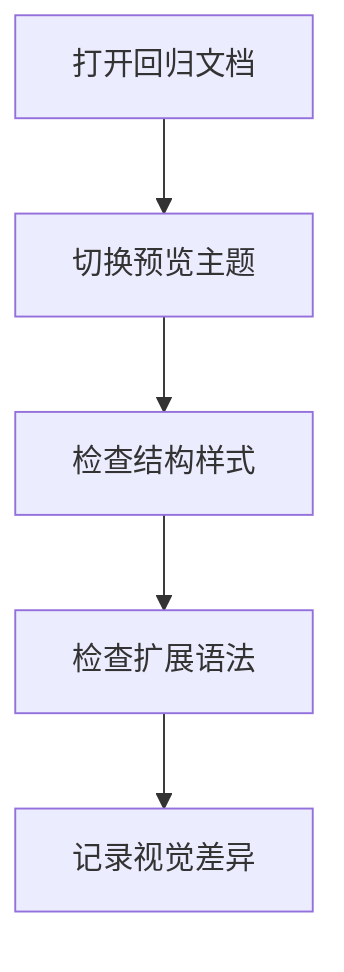

# 预览主题全语法回归样本

这是一份用于人工检查预览主题表现的综合样本，尽量覆盖当前程序实际支持的 Markdown 与扩展语法。

建议检查时重点关注：

- 标题层级、段落节奏、引用块间距
- 列表缩进、任务列表、定义列表
- 表格边框、行内代码、代码块、Mermaid、公式
- GitHub Alert、自定义容器、脚注、图片、音视频
- 原生 HTML 片段在不同主题下的兼容表现

---

## 标题层级

# 一级标题

## 二级标题

### 三级标题

#### 四级标题

##### 五级标题

###### 六级标题

---

## 段落与行内样式

这是一个普通段落，包含 **粗体**、*斜体*、***粗斜体***、~~删除线~~、==高亮==、++插入文本++、上标 2^10^、下标 H~2~O，以及行内代码 `const previewTheme = 'github'`。

这一段同时包含自动识别链接 https://example.com/docs/preview-theme?from=sample 与普通链接 [OpenAI](https://openai.com/)。

这一段测试换行行为，第一行结束后直接换行
第二行应保持同一段中的换行表现。

这段用于测试文字颜色扩展：{red}(红色文本)、{#1677ff}(蓝色文本)、{linear-gradient(90deg, rgba(21, 143, 21, 1) 5%, rgba(179, 39, 58, 1) 78%)}(渐变文本)。

欢迎使用 <u>{linear-gradient(90deg, rgba(21, 143, 21, 1) 5%, rgba(179, 39, 58, 1) 78%)}(**wj-markdown-editor**)</u> 编辑器。

---

## 引用块

> 这是一个单段引用块，用于检查边框、缩进与文字颜色。

> 这是一个多段引用块的第一段。
>
> 第二段用于检查首段与末段间距是否正确。
>
> - 引用中的无序列表
> - 第二项
>
> `引用中的行内代码`

---

## 列表

### 无序列表

- 第一项
- 第二项
- 第三项
  - 嵌套子项 A
  - 嵌套子项 B

### 有序列表

1. 第一项
2. 第二项
3. 第三项
   1. 嵌套编号 1
   2. 嵌套编号 2

### 任务列表

- [x] 已完成任务
- [ ] 未完成任务
- [x] 包含 **强调文本** 的任务

---

## 定义列表

Markdown
: 一种轻量级标记语言。

预览主题
: 一组通过 CSS 变量与主题覆盖规则实现的视觉风格。

---

## 分割线

---

***

___

---

## 表格

| 列名 | 左对齐 | 居中 | 右对齐 |
| :--- | :--- | :---: | ---: |
| 第一行 | 文本 | 123 | 999 |
| 第二行 | **粗体** | `code` | [链接](https://example.com) |
| 第三行 | 多行<br>HTML 换行 | H~2~O | 2^10^ |

---

## 图片

### 普通图片


### 指定尺寸图片


---

## 音频与视频

!audio(./wj-markdown-editor-web/src/assets/style/__tests__/fixtures/assets/example.mp3)

!video(./wj-markdown-editor-web/src/assets/style/__tests__/fixtures/assets/example.mp4)

---

## 代码

### 普通代码块

```text
这是一段未指定语言的代码块。
用于检查默认代码块背景、内边距和滚动条表现。
```

### JavaScript 代码块

```java
/**
 * 按主键更新导线标点
 *
 * @param uuid 杆塔主键
 * @param points 导线标点
 * @return 修改成功时间
 */
@Override
public String updatePolePoints(String uuid, String points) {
  PoleDO existedPole = poleMapper.queryByUuid(uuid);
  if (Objects.isNull(existedPole)) {
    throw new FwpException(StatusCodeEnum.POLE_NOT_EXISTED);
  }

  PoleDO updatePole = new PoleDO();
  updatePole.setUuid(uuid);
  updatePole.setPoints(points);
  poleMapper.updateByPrimarySelectivePole(updatePole);
  return LocalDateTime.now().format(DATE_TIME_FORMATTER);
}
```

```js
function previewThemeSample(themeName) {function previewThemeSample(themeName) {function previewThemeSample(themeName) {function previewThemeSample(themeName) {function previewThemeSample(themeName) {
  const supportsDarkMode = true
  console.log('----------------------------------------------------------------------------')
  return {
    themeName,
    supportsDarkMode,
    updatedAt: '2026-03-25',
  }
}

console.log(previewThemeSample('github'))
```

### Mermaid 图表



---

## 公式

行内公式：$E = mc^2$、$\sqrt{a^2 + b^2}$、$\sum_{i=1}^{n} i$。

块级公式：

$$
\int_{0}^{1} x^2 \, dx = \frac{1}{3}
$$

$$
\begin{bmatrix}
1 & 2 \\
3 & 4
\end{bmatrix}
$$

---

## GitHub Alert

> [!NOTE] 自定义标题
> 这是一个 Note 提示块。

> [!TIP]
> 这是一个 Tip 提示块。

> [!IMPORTANT]
> 这是一个 Important 提示块。

> [!WARNING]
> 这是一个 Warning 提示块。

> [!CAUTION]
> 这是一个 Caution 提示块。

---

## 自定义容器

::: info 自定义标题
这是一个 Info 容器。
:::

::: tip
这是一个 Tip 容器。
:::

::: important
这是一个 Important 容器。
:::

::: warning
这是一个 Warning 容器。
:::

::: danger
这是一个 Danger 容器。
:::

::: details 查看详情
这里是 Details 容器的内容。

- 可放列表
- 可放段落

`details` 容器用于检查展开区域样式。
:::

---

## 脚注

这是一个脚注引用。[^footnote-one]

同一个脚注再次引用。[^footnote-one]

这是第二个脚注引用。[^footnote-two]

[^footnote-one]: 这是第一个脚注的内容。
[^footnote-two]: 这是第二个脚注的内容，其中包含 **粗体** 与 [链接](https://example.com)。

---

## 锚点链接

[跳转到唯一标题](<#唯一标题>)

[跳转到第一个 Hello World](<#hello-world>)

[跳转到第二个 Hello World](<#hello-world-1>)

### 唯一标题

这是唯一标题对应的内容。

### Hello World

这是第一个重复标题。

### Hello World

这是第二个重复标题。

---

## 原生 HTML 片段

<u>这是原生 HTML 下划线文本。</u>

<kbd>Ctrl</kbd> + <kbd>Shift</kbd> + <kbd>P</kbd>

<details open>
  <summary>原生 HTML details</summary>
  <p>这里是原生 HTML 的 details 内容。</p>
</details>

<div>
  <label for="sample-text-input">文本输入框：</label>
  <input id="sample-text-input" type="text" value="主题回归输入框" />
</div>

<div>
  <label for="sample-search-input">搜索框：</label>
  <input id="sample-search-input" type="search" value="search keyword" />
</div>

<div>
  <label for="sample-number-input">数字输入框：</label>
  <input id="sample-number-input" type="number" value="12" />
</div>

<div>
  <label><input type="checkbox" checked /> 复选框</label>
  <label><input type="radio" name="sample-radio" checked /> 单选框 A</label>
  <label><input type="radio" name="sample-radio" /> 单选框 B</label>
</div>

<div>
  <label for="sample-select">下拉框：</label>
  <select id="sample-select">
    <option>选项一</option>
    <option>选项二</option>
    <option>选项三</option>
  </select>
</div>

<div>
  <label for="sample-textarea">文本域：</label>
  <textarea id="sample-textarea" rows="3">这里是文本域内容。</textarea>
</div>

<div>
  <button type="button">普通按钮</button>
  <button type="submit">提交按钮</button>
  <button type="reset">重置按钮</button>
</div>

---

## 结束检查

如果你在不同预览主题下查看本文件，建议至少对比以下内容：

- 标题与段落的上下节奏
- 引用块、表格、列表、脚注
- 行内代码、代码块、Mermaid、公式
- GitHub Alert 与自定义容器
- 图片、音视频与原生 HTML 表单控件
